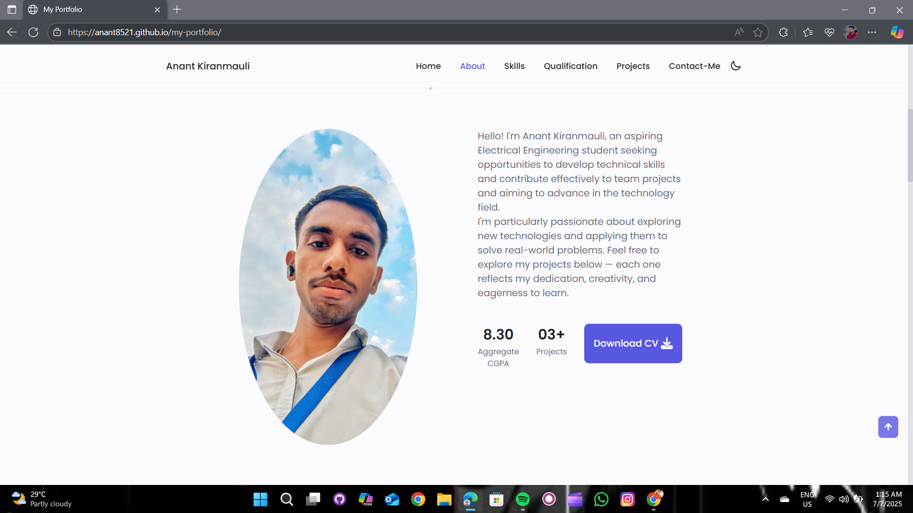
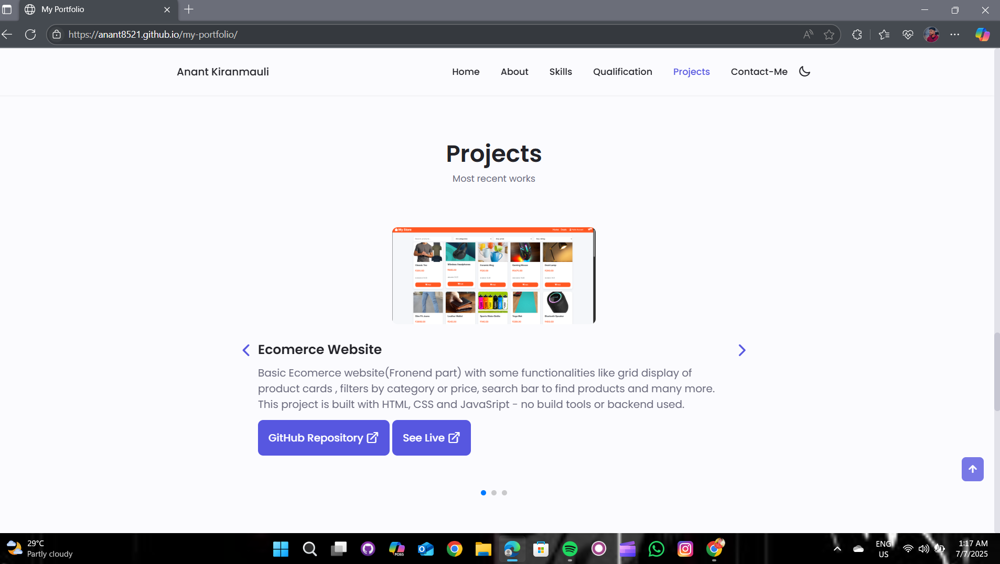

# 🌐 Personal Portfolio Website

[](https://anant8521.github.io/my-portfolio/)

---

## 📌 Problem Statement

In the digital age, a strong online presence is vital. Many students and job seekers struggle to present their skills and accomplishments in a well-structured format. This project addresses that gap by providing a professional personal portfolio website.

---

## 🎯 Objective

Develop a **responsive personal portfolio website** that:

- Highlights your **skills, education, certifications, projects, and achievements**
- Includes an option to **download your resume (PDF)**
- Reflects your **personality** and is accessible across all devices

---

## 🧰 Features

- 🧑‍💼 **About Me** – Brief introduction and background  
- 💡 **Skills** – Technical and soft skills  
- 💼 **Projects** – Showcased personal and academic projects  
- 🏅 **Achievements** – Certifications and recognitions  
- 📄 **Downloadable Resume** – In PDF format  
- 🔗 **Social Media Links** – Connect with your professional network  
- 📱 **Responsive Design** – Optimized for mobile, tablet, and desktop  
- ☁️ **Hosted on GitHub Pages** – Easily accessible via live link  

---

## 💻 Tech Stack

| Frontend    | Hosting        |
|-------------|----------------|
| HTML5       | GitHub Pages   |
| CSS3        |                |
| JavaScript  |                |

---

## 🚀 Live Demo

🔗 **See it live** here:  
👉 [https://anant8521.github.io/my-portfolio/](https://anant8521.github.io/my-portfolio/)

---

## 📥 How to Use Locally

1. Clone this repository:
   ```bash
   git clone https://github.com/anant8521/my-portfolio.git
   ```
2. Navigate into the project directory:
   ```bash
   cd my-portfolio
   ```
3. Open `index.html` in your browser.

---

## 📸 Screenshots

| Section             |            Screenshot              |
|---------------------|------------------------------------|
| 🔹 Intro            |          |
| 🔹 About          |          |
| 🔹 Projects         |       |
| 🔹 Education        |  |
| 🔹 Contact        |   |

> 📝 *Make sure your screenshots are stored in the `/screenshots` folder in your repository.*

---

## 📄 License

This project is open-source and available under the [MIT License](LICENSE).

---
## 👨‍💻 Portfolio 

**Anant Kiranmauli**  
🎓 Electrical Engineering Student  
📍 Government Polytechnic, Munger  
🧠 Interests: Coding, Logic, and Engineering Applications


---


